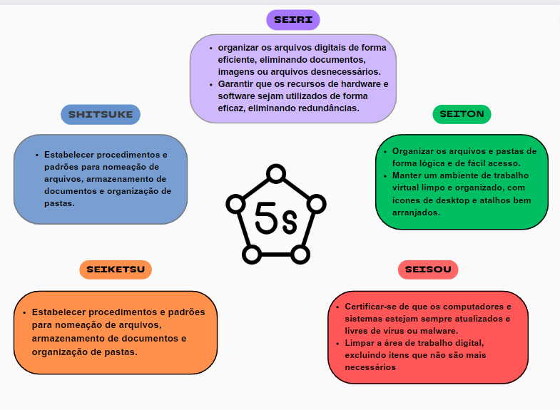

# Projeto Integrador (API1) - Template

Template do Projeto integrador do 1º Semestre do Curso Superior em Logística, com o objetivo de demonstrar entendimento,em relação a termos técnicos logísticos, cadeias produtivas internacionalizadas e infraestruturas de transporte. 

Projeto baseado na metodologia ágil SCRUM, a fim de demonstrar entendimento sobre a importância do uso do conhecimento técnico e científico, e suas tecnologias, para a resolução de desafios acadêmicos e empresariais.

# Índice

* [Projeto](#projeto-template)
* [Empresa](#Empresa)
* [Micro Certificações](#Certificados)
* [Equipe](#equipe)
* [Objetivo do Projeto](#objetivo-do-projeto)
* [Funcionalidades e Registros](#Funcionalidades-e-Registros)
* [Cronograma das Sprints](#Cronograma-das-Sprints)
* [Backlog do produto](#Backlog-do-produto)
* [Burndown](#Burndown)
* [Competências desenvolvidas](#competências-desenvolvidas)
* [Autores](#autores)

# Projeto (API) 

Mapear o potencial de movimentação de cargas no Aeroporto Internacional de São José dos Campos Professor Urbano Ernesto Stumpf com base em dados de importações e exportações de Municípios. 

 
Sprint | Previsão | Status| Histórico|
|------|--------|------|--------|
|Kick Off | 04/09/2023 | Concluido| [Ver Relatório](https://fatecspgov.sharepoint.com/:p:/r/sites/Section_PLG001.A994.M.074.146.20232/_layouts/15/doc2.aspx?sourcedoc=%7B9BCC5366-75DE-4D16-A03B-0D9D89063553%7D&file=Kick-off%20API%201M.pptx&action=edit&mobileredirect=true) | 
|00 | 25/09/2023 | Concluido| [Ver Relatório](https://fatecspgov-my.sharepoint.com/personal/josiane_araujo_fatec_sp_gov_br/_layouts/15/onedrive.aspx?id=%2Fpersonal%2Fjosiane%5Faraujo%5Ffatec%5Fsp%5Fgov%5Fbr%2FDocuments%2FMicrosoft%20Teams%20Chat%20Files%2Fpdf%20relat%C3%B3rio%2Epdf&parent=%2Fpersonal%2Fjosiane%5Faraujo%5Ffatec%5Fsp%5Fgov%5Fbr%2FDocuments%2FMicrosoft%20Teams%20Chat%20Files) | 
|01|  16/10/2023| Não Iniciado |[Ver Relatório](https://fatecsjc-prd.azurewebsites.net/downloads/estagio/modelo_relatorio_estagio_gpi.docx) | 
|02| 06/11/2023| Não Iniciado|[Ver Relatório](https://fatecsjc-prd.azurewebsites.net/downloads/estagio/modelo_relatorio_estagio_gpi.docx) | 
|03| 27/11/2023 | Não Iniciado |[Ver Relatório](https://fatecsjc-prd.azurewebsites.net/downloads/estagio/modelo_relatorio_estagio_gpi.docx)  | 
|Feira de Soluções|12/12/2023 |Não Iniciado|[Ver Relatório](https://fatecsjc-prd.azurewebsites.net/downloads/estagio/modelo_relatorio_estagio_gpi.docx) | 

# Empresa

> Logo

      

> Missão

A missão da Space Logtec é realizar consultorias  de maneira eficiente e ágil, proporcionando melhorias para  nossos clientes na área de análise de dados.

> Visão

Ser a melhor empresa de consultoria  de análise  de dados do vale do paraiba, visando a superior satisfação dos consumidores.

> Valores

- Bem-estar.
- Colaboração.
- Satisfação
- Inclusão.
- Inovação.
- Educação.

> Estrutura Organizacional 

 

      

> 5S

      

> Análise SWOT

      

# Micro Certificações
Futuramente

 

# Equipe

# Autores
|    Função     | Nome                                  |                                                                                                                                                      LinkedIn & GitHub                                                                                                                                                      |
| :-----------: | :------------------------------------ | :-------------------------------------------------------------------------------------------------------------------------------------------------------------------------------------------------------------------------------------------------------------------------------------------------------------------------: |
| Product Owner |   Yasmin Isabele F. G. dos Santos        |                    |
| Scrum Master  | Josiane Viana de Araújo |            |
| Team Member   | João Pedro dos Santos              |                  |
|  Team Member  | Katia Patrícia Viana                |                  |
|  Team Member  | Anderson de Carvalho Sério                |       |
|  Team Member  | Laura da Silva Barros       |                      |
|  Team Member  | Wilson Roberto Costa       |                      |

# Objetivo do Projeto

Este projeto tem como objetivo Mapear o potencial  de movimentação de cargas no aeroporto de SJK com base em dados de importação e exportação, visando:

- Demonstrar entendimento sobre: termos técnicos logísticos , cadeias produtivas internacionalizadas e infraestruturas de transporte.

- Saber utilizar tecnologias Microsoft Power Plataform ( Power BI ) para capturar, tratar, organizar, armazenar e apresentar dados característicos.
  
- Saber utilizar a tecnologia Github para gerar o portfolio do projeto e desenvolver seu próprio portfolio pessoal.
  
- Demonstrar automonia ao atuar em ambiente ágil de trabalho na metodologia Scrum.

- Demonstrar entendimento sobre o papel das soft skills no desenvolvimento profissional e pessoal.

- Demonstrar entendimento sobre a importância do uso do conhecimento técnico e científico, e suas tecnologias, para a resolução de desafios acadêmicos e empresariais.

# Funcionalidades e Registros 

> Apresentação das funcionalidades e Registros Educacionais.

## Bases Tecnológicas 

  ### MVP do Produto 

  > Descreva aqui o MVP do Produto.

 ### Tecnológias de Apoio

 > Liste aqui todas as tecnologias utilizadas para colcluir a entrega

 ### Mindset Digital

> Liste aqui todas as tecnologias de Mindset digital utilizadas no API.

## Cronograma

 > Ao clicar você será redirecionado ao cronograma detalhado deste projeto, lá é possivel encontar as datas das atividades, o responsável por cada atividade, o estágio em que cada atividade se encontra e a qual sprint cada atividade pertence.

#### Cronograma das Sprints[(clique aqui)]()

# Backlog do produto

  > Coloque o Backlog do Produto.

**Regras de Negócio**

- 
-
-

**Requisitos funcionais** 

-    
- 
-
  
**Requisitos não funcionais**

- 
- 
- 
  

# Burndown

> Coloque o burndown da empresa.

## Sprint 0. 

- [ ] 
- [ ] 
- [ ] 
- [ ]      
- [ ] 
      

## Sprint 1. 

- [ ] 
- [ ] 
- [ ] 
- [ ]      
- [ ] 
      
## Sprint 2. 

- [ ] 
- [ ] 
- [ ] 
- [ ] 

## Sprint 3.

- [ ] 
- [ ] 
- [ ] 
- [ ] 

# Competências desenvolvidas

## Hard Skill (Saber tecnológico)

Hard Skills desenvolvidas

  
| Tecnologia/Metodologia | Classificação |
| ---------------------- | ------------- |
| GitHub |  ☆ ☆ ☆ ☆ ☆ ☆ ☆ ☆ ☆ ☆ |
| Gestão de Projetos |  ☆ ☆ ☆ ☆ ☆ ☆ ☆ ☆ ☆ ☆ |
| Scrum Master |  ☆ ☆ ☆ ☆ ☆ ☆ ☆ ☆ ☆ ☆ |
| Prodct Owner |  ☆ ☆ ☆ ☆ ☆ ☆ ☆ ☆ ☆ ☆ |
| Markdown |  ☆ ☆ ☆ ☆ ☆ ☆ ☆ ☆ ☆ ☆ |
| Git Projects |  ☆ ☆ ☆ ☆ ☆ ☆ ☆ ☆ ☆ ☆ |
 

## Soft Skill (Saber comportamental)

Soft Skills desenvolvidas

| Habilidades | Classificação |
| ---------------------- | ------------- |
| Colaboração |  ☆ ☆ ☆ ☆ ☆ ☆ ☆ ☆ ☆ ☆ |
| Proatividade|  ☆ ☆ ☆ ☆ ☆ ☆ ☆ ☆ ☆ ☆ |
| Pensamento Crítico |  ☆ ☆ ☆ ☆ ☆ ☆ ☆ ☆ ☆ ☆ |
| Gerenciamento de Tempo |  ☆ ☆ ☆ ☆ ☆ ☆ ☆ ☆ ☆ ☆ |
| Adaptabilidade |  ☆ ☆ ☆ ☆ ☆ ☆ ☆ ☆ ☆ ☆ |
| Resiliência |  ☆ ☆ ☆ ☆ ☆ ☆ ☆ ☆ ☆ ☆ |

