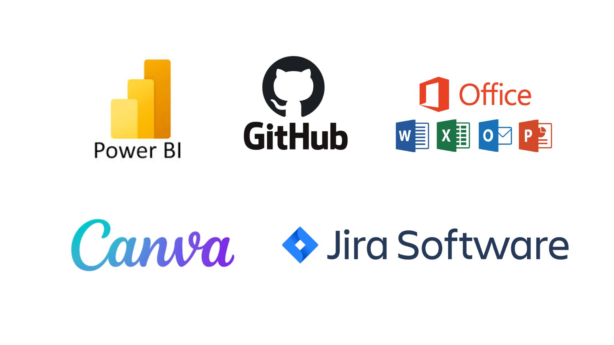
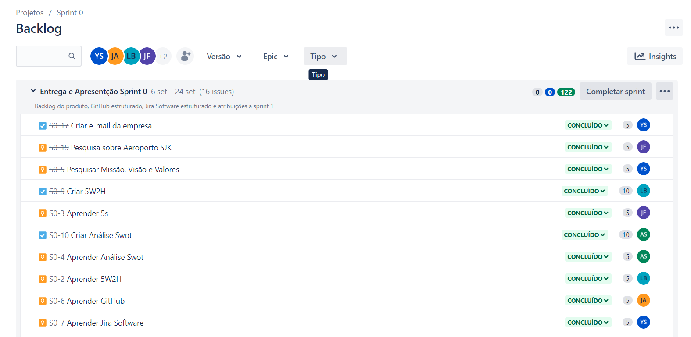
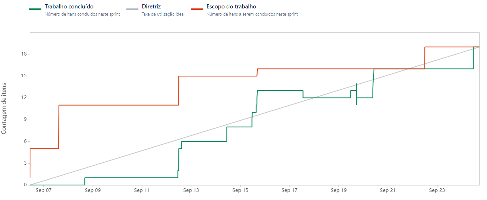

# Projeto Integrador (API1) - Template

Template do Projeto integrador do 1º Semestre do Curso Superior em Logística, com o objetivo de demonstrar entendimento,em relação a termos técnicos logísticos, cadeias produtivas internacionalizadas e infraestruturas de transporte. 

Projeto baseado na metodologia ágil SCRUM, a fim de demonstrar entendimento sobre a importância do uso do conhecimento técnico e científico, e suas tecnologias, para a resolução de desafios acadêmicos e empresariais.

# Índice

* [Projeto](#projeto-template)
* [Empresa](#Empresa)
* [Equipe](#equipe)
* [Objetivo do Projeto](#objetivo-do-projeto)
* [Funcionalidades e Registros](#Funcionalidades-e-Registros)
* [Cronograma das Sprints](#Cronograma-das-Sprints)
* [Backlog do produto](#Backlog-do-produto)
* [Burndown](#Burndown)
* [Competências desenvolvidas](#competências-desenvolvidas)

# Projeto (API) 

Mapear o potencial de movimentação de cargas no Aeroporto Internacional de São José dos Campos Professor Urbano Ernesto Stumpf com base em dados de importações e exportações de Municípios. 

 
Sprint | Previsão | Status| Histórico|
|------|--------|------|--------|
|Kick Off | 04/09/2023 | Concluido| [Ver Relatório](https://fatecspgov.sharepoint.com/:p:/r/sites/Section_PLG001.A994.M.074.146.20232/_layouts/15/doc2.aspx?sourcedoc=%7B9BCC5366-75DE-4D16-A03B-0D9D89063553%7D&file=Kick-off%20API%201M.pptx&action=edit&mobileredirect=true) | 
|00 | 25/09/2023 | Concluido| [Ver Relatório](API1sem/relatorio0log.pdf)| 
|01|  16/10/2023| Concluido |[Ver Relatório](API1sem/RelátorioSprit01.pdf) | 
|02| 06/11/2023| Concluido |[Ver Relatório]() | 
|03| 27/11/2023 | Não Iniciado |[Ver Relatório](https://fatecsjc-prd.azurewebsites.net/downloads/estagio/modelo_relatorio_estagio_gpi.docx)  | 
|Feira de Soluções|12/12/2023 |Não Iniciado|[Ver Relatório](https://fatecsjc-prd.azurewebsites.net/downloads/estagio/modelo_relatorio_estagio_gpi.docx) | 

# Empresa

> Logo

      

> Missão

A missão da Space Logtec é realizar consultorias  de maneira eficiente e ágil, proporcionando melhorias para  nossos clientes na área de análise de dados.

> Visão

Ser a melhor empresa de consultoria  de análise  de dados do vale do paraiba, visando a superior satisfação dos consumidores.

> Valores

- Bem-estar.
- Colaboração.
- Satisfação
- Inclusão.
- Inovação.
- Educação.

> Estrutura Organizacional 

 

      

> Análise SWOT

      

# Equipe

|    Função     | Nome                                  |                                                                                                                                                      LinkedIn & GitHub                                                                                                                                                      |
| :-----------: | :------------------------------------ | :-------------------------------------------------------------------------------------------------------------------------------------------------------------------------------------------------------------------------------------------------------------------------------------------------------------------------: |
| Product Owner |   Yasmin Isabele F. G. dos Santos        |                    |
| Scrum Master  | Josiane Viana de Araújo |            |
| Team Member   | João Pedro dos Santos              |                  |
|  Team Member  | Katia Patrícia Viana                |                  |
|  Team Member  | Anderson de Carvalho Sério                |       |
|  Team Member  | Laura da Silva Barros       |                      |
|  Team Member  | Wilson Roberto Costa       |                      |

# Objetivo do Projeto

Este projeto tem como objetivo Mapear o potencial  de movimentação de cargas no aeroporto de SJK com base em dados de importação e exportação, visando:

- Demonstrar entendimento sobre: termos técnicos logísticos , cadeias produtivas internacionalizadas e infraestruturas de transporte.

- Saber utilizar tecnologias Microsoft Power Plataform ( Power BI ) para capturar, tratar, organizar, armazenar e apresentar dados característicos.
  
- Saber utilizar a tecnologia Github para gerar o portfolio do projeto e desenvolver seu próprio portfolio pessoal.
  
- Demonstrar automonia ao atuar em ambiente ágil de trabalho na metodologia Scrum.

- Demonstrar entendimento sobre o papel das soft skills no desenvolvimento profissional e pessoal.

- Demonstrar entendimento sobre a importância do uso do conhecimento técnico e científico, e suas tecnologias, para a resolução de desafios acadêmicos e empresariais.

# Funcionalidades e Registros 

> MVP :  Dashboard de indicadores

  O objetivo do dashboard é fornecer ao cliente uma vizualização simples e ágil dos indicadores.

 ### Tecnológias de Apoio
 
 

      

## Cronograma das Sprints 

 > Ao clicar você será redirecionado ao cronograma detalhado deste projeto, lá é possivel encontar as datas das atividades, o responsável por cada atividade, o estágio em que cada atividade se encontra e a qual sprint cada atividade pertence.

#### Cronograma [(clique aqui)]()

# Backlog do produto

  > Sprint 0

      

  > Sprint 1

      

  > Sprint 2
> 

      

  

# Burndown

## Burndown 0. 

      

## Burndown 1. 

      

## Burndown 2. 

## Burndown 3. 

# Competências desenvolvidas

## Hard Skill (Saber tecnológico)

Hard Skills desenvolvidas

  
| Tecnologia/Metodologia | Classificação |
| ---------------------- | ------------- |
| GitHub |  ☆ ☆ ☆ ☆ ☆ ☆ ☆ ☆ ☆ ☆ |
| Gestão de Projetos |  ☆ ☆ ☆ ☆ ☆ ☆ ☆ ☆ ☆ ☆ |
| Scrum Master |  ☆ ☆ ☆ ☆ ☆ ☆ ☆ ☆ ☆ ☆ |
| Prodct Owner |  ☆ ☆ ☆ ☆ ☆ ☆ ☆ ☆ ☆ ☆ |
| Markdown |  ☆ ☆ ☆ ☆ ☆ ☆ ☆ ☆ ☆ ☆ |
| Git Projects |  ☆ ☆ ☆ ☆ ☆ ☆ ☆ ☆ ☆ ☆ |
 

## Soft Skill (Saber comportamental)

Soft Skills desenvolvidas

| Habilidades | Classificação |
| ---------------------- | ------------- |
| Colaboração |  ☆ ☆ ☆ ☆ ☆ ☆ ☆ ☆ ☆ ☆ |
| Proatividade|  ☆ ☆ ☆ ☆ ☆ ☆ ☆ ☆ ☆ ☆ |
| Pensamento Crítico |  ☆ ☆ ☆ ☆ ☆ ☆ ☆ ☆ ☆ ☆ |
| Gerenciamento de Tempo |  ☆ ☆ ☆ ☆ ☆ ☆ ☆ ☆ ☆ ☆ |
| Adaptabilidade |  ☆ ☆ ☆ ☆ ☆ ☆ ☆ ☆ ☆ ☆ |
| Resiliência |  ☆ ☆ ☆ ☆ ☆ ☆ ☆ ☆ ☆ ☆ |

